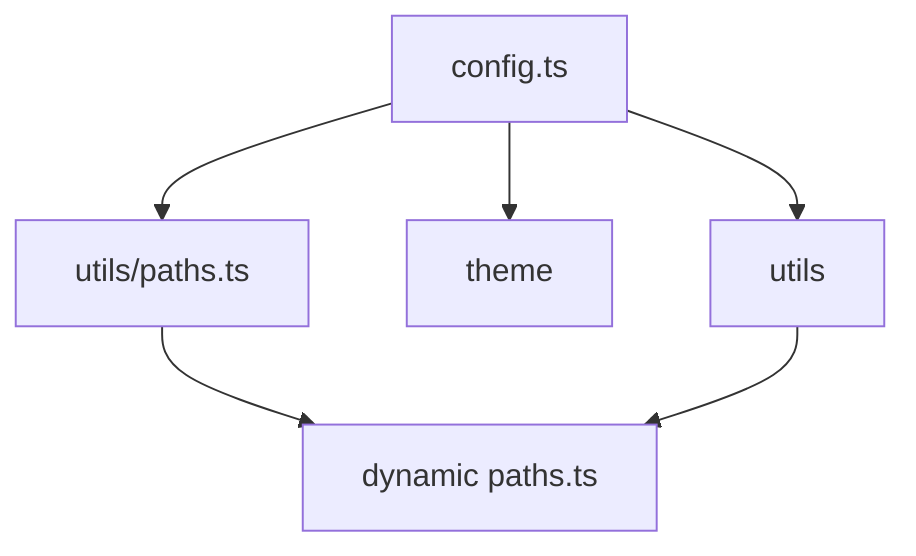

# Luncher Documentation

VitePressで構築されたドキュメントサイトです。

## 必要な環境

- Docker ランタイム環境 (Docker Desktop, Rancher Desktop, OrbStack など)
- Dev Container 対応 IDE (VS Code, Cursor など)

## セットアップ

このプロジェクトは Dev Container での開発を前提としています。

1. IDE でこのプロジェクトを開きます。
2. Dev Container を起動します（例: VS Code の場合、コマンドパレットから **Dev Containers: Reopen in Container** を実行）。
3. コンテナが起動し、自動的に依存関係がインストールされるのを待ちます。

## 利用可能なコマンド

コンテナ内のターミナルで以下のコマンドが利用可能です。

- `pnpm dev` - 開発サーバーを起動（http://localhost:5173）
- `pnpm build` - プロダクションビルド
- `pnpm preview` - ビルド結果をプレビュー
- `pnpm lint` - ESLintでコードをチェック
- `pnpm lint:fix` - ESLintでコードを自動修正
- `pnpm format` - Prettierでコードをフォーマット

## プロジェクト構造

```
├── docs/                                 # ドキュメントのソースファイル
|     ├── .vitepress/                     # VitePress設定ファイル
|     ├── [locale]/                       # 動的ルーティング用のロケール/バージョン構造
|     ├── en/                             # 英語版ドキュメント
|     ├── ja/                             # 日本語版ドキュメント
|     |     └── 1.0.0/                    # バージョン別ドキュメント
|     |           ├── api/                # API仕様
|     |           ├── batch/              # バッチ処理
|     |           |     ├── design/       # バッチ設計
|     |           |     └── flow/         # バッチフロー
|     |           ├── database/           # データベース設計
|     |           |     └── cdm.md        # 概念データモデル
|     |           ├── history/            # 変更履歴
|     |           ├── infrastructure/     # インフラストラクチャ
|     |           └── screen/             # 画面設計
|     |                 ├── design/       # 画面設計詳細
|     |                 └── flow/         # 画面フロー
|     ├── public/                         # 共有リソース（用語集、メッセージなど）
|     |     ├── 1.0.0/                    # バージョン別共有リソース
|     |     |     ├── batch/              # バッチ関連メッセージ
|     |     |     |     └── messages.yml
|     |     |     ├── database/           # データベース定義
|     |     |     |     └── table/        # テーブル定義
|     |     |     ├── glossary.yml        # 用語集
|     |     |     └── screen/             # 画面関連メッセージ
|     |     |           └── messages.yml
|     |     ├── cover.png                 # カバー画像
|     |     ├── batcn/                    # バッチ
|     |     ├── database/                 # バッチ
|     |     ├── erd/                      # Liam ERD (pnpm db:erd コマンドで packages/db/src/schema.ts から出力)
|     |     └── openapi/                  # ダイアグラム（Mermaid生成SVGなど）
|     └── index.md                        # ルートページ
├── .devcontainer/                        # Dev Container設定
├── .husky/                               # Gitフック設定
└── .github/                              # GitHub設定（PRテンプレートなど）
```

## VitePress カスタマイズ

仕様書の Markdown とは別に、**ビルド・ナビ・動的ページ** は次のレイヤに分かれています。

| 場所                                     | 役割                                                                                                                                                            |
| ---------------------------------------- | --------------------------------------------------------------------------------------------------------------------------------------------------------------- |
| `docs/.vitepress/config.ts`              | `base`、Vite プラグイン、多言語 `locales`、各バージョンの **サイドバー・nav** を組み立て。OpenAPI / PDM / 用語集 / 履歴などは **`utils` の関数**で配列を生成。  |
| `docs/.vitepress/theme/`                 | デフォルトテーマの拡張（`theme/index.ts`）、**vitepress-openapi** 連携、Vue コンポーネント（`MainNav`、`VersionSwitcher`、`OperationLayout` 等）、`style.css`。 |
| `docs/.vitepress/utils/`                 | ビルド時ロジック（OpenAPI 探索、サイドバー生成、HCL/PDM、用語集 YAML、バージョン一覧、`docLoader` 等）。**`utils/paths.ts`** に `docsDir` など絶対パス定数。    |
| `docs/[locale]/[version]/.../*.paths.ts` | 動的ルートの **`paths()`**。多くの場合 **`utils/paths`** とその他 **`utils`** を import。                                                                       |



- **ナビ・サイドバー・base** → まず `config.ts`
- **画面上の部品・OpenAPI の見え方** → `theme/`
- **データの出どころ（API・PDM・用語集など）** → `utils/`
- **URL の動的セグメント** → `[locale]/[version]/...` 以下の `*.paths.ts`
