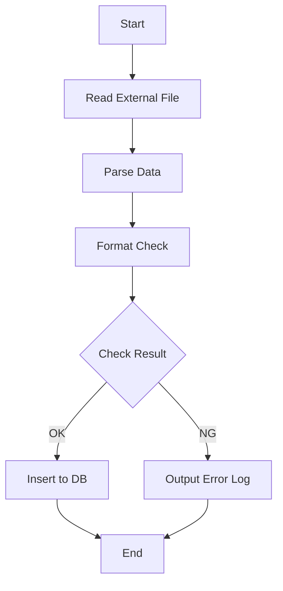

# BAT-001: Data Import Batch

<BasicInfo
  v-if="section"
  :title="section.infoTitle"
  :fields="section.fields"
  :data="frontmatter"
/>

## Process Flow

## Input

| Type | Name            | Description                      |
| ---- | --------------- | -------------------------------- |
| File | import_data.csv | Export file from external system |

## Output

| Type  | Name        | Description          |
| ----- | ----------- | -------------------- |
| Table | import_data | Stores imported data |
| Log   | bat-001.log | Execution log        |

## Error Handling

| Error Code | Description         | Action                              |
| ---------- | ------------------- | ----------------------------------- |
| E001       | File not found      | Alert notification, abort process   |
| E002       | Invalid file format | Output error log, abort process     |
| E003       | Invalid data format | Skip error record, continue process |
