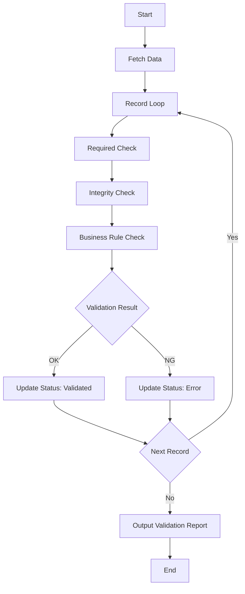

# BAT-002: Data Validation Batch

<BasicInfo
  v-if="section"
  :title="section.infoTitle"
  :fields="section.fields"
  :data="frontmatter"
/>

## Process Flow

## Input

| Type  | Name        | Description              |
| ----- | ----------- | ------------------------ |
| Table | import_data | Data imported by BAT-001 |

## Output

| Type  | Name              | Description              |
| ----- | ----------------- | ------------------------ |
| Table | import_data       | Status update            |
| Table | validation_errors | Validation error details |
| Log   | bat-002.log       | Execution log            |

## Validation Rules

| Rule ID | Field       | Rule                                    |
| ------- | ----------- | --------------------------------------- |
| V001    | Customer ID | Required, must exist in customer master |
| V002    | Amount      | Required, numeric value >= 0            |
| V003    | Date        | Required, valid date format             |

## Error Handling

| Error Code | Description         | Action                    |
| ---------- | ------------------- | ------------------------- |
| E001       | No target data      | Normal end (skip process) |
| E002       | DB connection error | Alert notification, retry |
