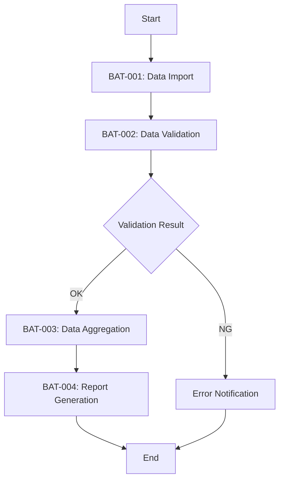

# FLW-001: Daily Batch Flow

<BasicInfo
  v-if="section"
  :title="section.infoTitle"
  :fields="section.fields"
  :data="frontmatter"
/>

## Flow Diagram

## Execution Order

| Order | Batch ID | Batch Name        | Dependency |
| ----- | -------- | ----------------- | ---------- |
| 1     | BAT-001  | Data Import       | None       |
| 2     | BAT-002  | Data Validation   | BAT-001    |
| 3     | BAT-003  | Data Aggregation  | BAT-002    |
| 4     | BAT-004  | Report Generation | BAT-003    |

## Error Behavior

| Source Batch | Behavior                                    |
| ------------ | ------------------------------------------- |
| BAT-001      | Abort process, alert notification           |
| BAT-002      | Error notification, skip subsequent batches |
| BAT-003      | Abort process, alert notification           |
| BAT-004      | Abort process, alert notification           |
