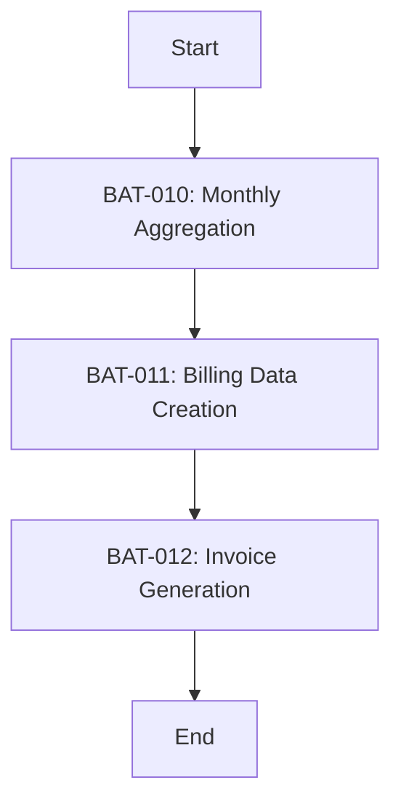

# FLW-002: Monthly Batch Flow

<BasicInfo
  v-if="section"
  :title="section.infoTitle"
  :fields="section.fields"
  :data="frontmatter"
/>

## Flow Diagram

## Execution Order

| Order | Batch ID | Batch Name            | Dependency |
| ----- | -------- | --------------------- | ---------- |
| 1     | BAT-010  | Monthly Aggregation   | None       |
| 2     | BAT-011  | Billing Data Creation | BAT-010    |
| 3     | BAT-012  | Invoice Generation    | BAT-011    |

## Error Behavior

| Source Batch | Behavior                          |
| ------------ | --------------------------------- |
| BAT-010      | Abort process, alert notification |
| BAT-011      | Abort process, alert notification |
| BAT-012      | Abort process, alert notification |
