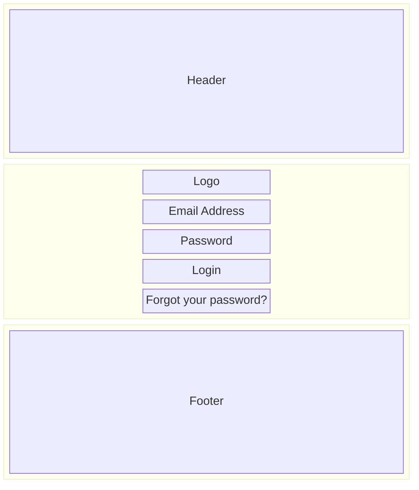

# SCR-001: Login Screen

## Layout

<BasicInfo
  v-if="section"
  :title="section.infoTitle"
  :fields="section.fields"
  :data="frontmatter"
/>

## Input Fields

| Field Name    | Required | Type     | Max Length | Validation    |
| ------------- | -------- | -------- | ---------- | ------------- |
| Email Address | Yes      | text     | 256        | Email format  |
| Password      | Yes      | password | 128        | 8+ characters |

## Buttons & Links

| Name                  | Type   | Action                                              |
| --------------------- | ------ | --------------------------------------------------- |
| Login                 | Button | Execute authentication, navigate to Home on success |
| Forgot your password? | Link   | Navigate to Password Reset screen                   |

## Error Messages

| Code | Message                            | Condition             |
| ---- | ---------------------------------- | --------------------- |
| E001 | Please enter your email address    | Email is empty        |
| E002 | Please enter a valid email address | Invalid email format  |
| E003 | Please enter your password         | Password is empty     |
| E004 | Invalid email or password          | Authentication failed |
