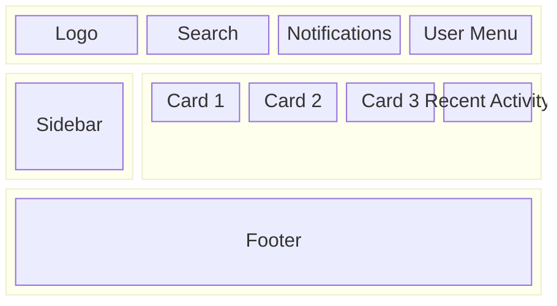

# SCR-010: Home Screen

## Layout

<BasicInfo
  v-if="section"
  :title="section.infoTitle"
  :fields="section.fields"
  :data="frontmatter"
/>

## Display Items

| Item Name          | Description                       |
| ------------------ | --------------------------------- |
| Summary Cards      | Display key statistics            |
| Recent Activity    | Display recent operation history  |
| Notification Badge | Display unread notification count |

## Actions

| Name              | Action                                 |
| ----------------- | -------------------------------------- |
| Notification Icon | Navigate to Notifications screen       |
| User Menu         | Display dropdown menu                  |
| Sidebar Items     | Navigate to respective feature screens |
