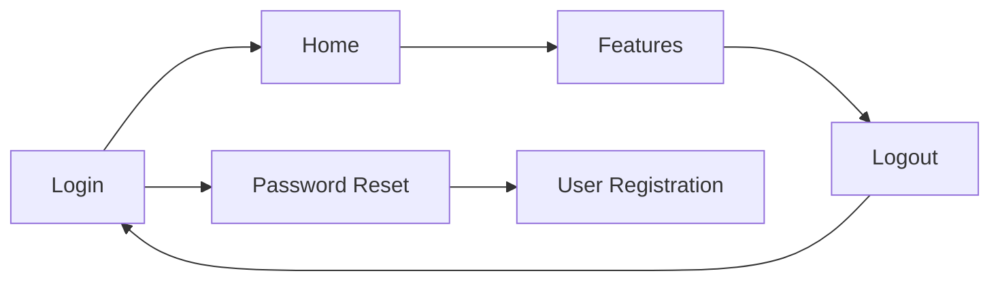

# SCR-FLW-001: Authentication Flow

<BasicInfo
  v-if="section"
  :title="section.infoTitle"
  :fields="section.fields"
  :data="frontmatter"
/>

## Flow Diagram

## Transition Rules

1. After successful login, the user is taken to Home and can access authenticated pages only.
2. Logging out always returns to the Login screen and clears the session.
3. Password reset returns to Login; from there users may proceed to registration if needed.
