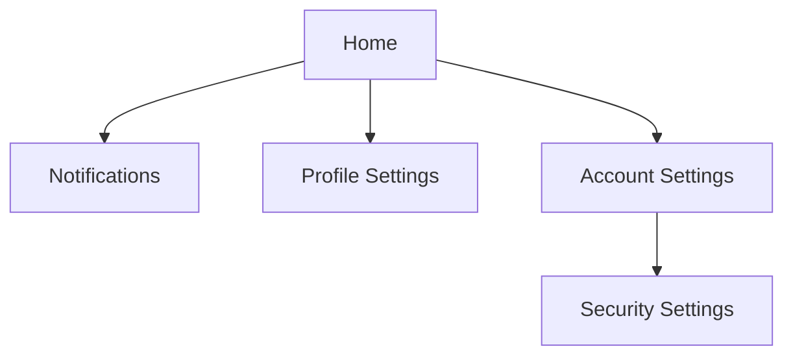

# SCR-FLW-002: Main Flow

<BasicInfo
  v-if="section"
  :title="section.infoTitle"
  :fields="section.fields"
  :data="frontmatter"
/>

## Flow Diagram

## Transition Rules

1. Users can navigate directly from Home to each feature page.
2. Security settings is accessible only through Account settings.
3. All feature pages provide navigation back to Home.
