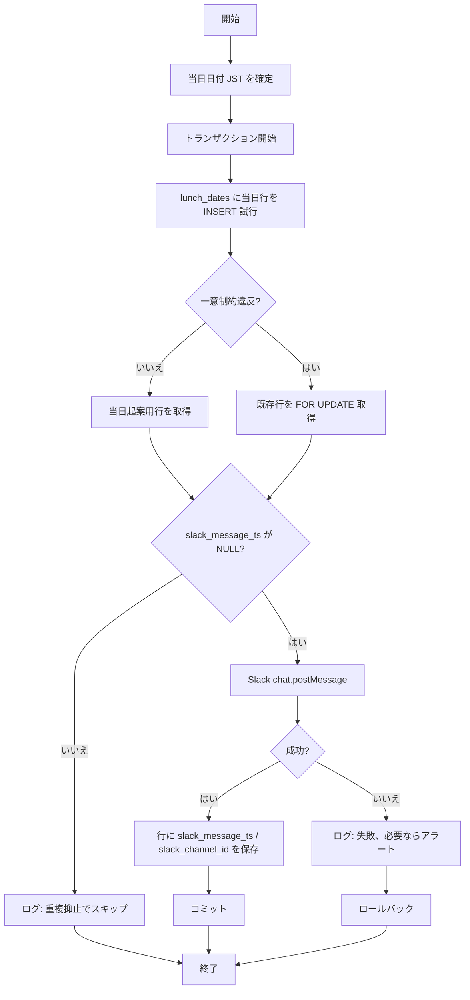

# BAT-001: 日次コラボランチ案内配信

<BasicInfo
  v-if="section"
  :title="section.infoTitle"
  :fields="section.fields"
  :data="frontmatter"
/>

## ユーザーストーリー

- [US-001: 日次のコラボランチ案内を Slack に配信できる](../../user-stories/us-001.md)

## 目的

毎日 10:00（JST）に、当日のコラボランチ募集メッセージを **指定 Slack チャンネルに 1 回** 投稿し、参加表明（US-002）の起点とする。あわせて **当日枠** を DB に登録する。

## 処理フロー

## 入力

| 種別 | 名称 | 説明 |
| ---- | ---- | ---- |
| 環境設定 | `SLACK_BOT_TOKEN` 等 | Slack API 呼び出し（機微は環境変数・Secret） |
| 環境設定 | 案内先チャンネル ID | 募集を投稿するチャンネル（要件: デプロイ時設定。将来 `system_configs` 参照に寄せうる） |
| 参照 | システム日時 | 当日の `lunch_date`（JST）算出に使用 |

## 出力

| 種別 | 名称 | 説明 |
| ---- | ---- | ---- |
| テーブル | [lunch_dates](../../database/pdm/table/lunch_dates) | 開催日（ドラフト `lunch_dates`）。`slack_message_ts` で重複抑止 |
| Slack | 募集メッセージ 1 件 | 文面はテンプレ＋必要ならテンプレ ID（`batch/messages` 由来のコードと紐づけ可） |
| ログ | 構造化ログ | 成功 / 重複抑止スキップ / 失敗（本文に run id、lunch_date、message ts） |

## 呼び出し

本バッチの業務ロジックは [日次案内の実行（内部ジョブ）](../../api/design/postDailyLunchAnnouncement.md) として HTTP で起動しうる。スケジューラ（例: EventBridge）→ **POST** 本ジョブ、の形を想定する。

## エラーハンドリング

| 事象 | 動作 |
| ---- | ---- |
| Slack 一時障害 | 再試行方針に従う。`slack_message_ts` 未設定のままの場合、再実行で再投稿可（成功時に保存） |
| 一意制約・行ロック | 他プロセスと同日を処理中。既存行を取得して二重投稿判定に回す |
| 当日行が既に投稿済み | 新規投稿を行わず、メッセージコード W-BAT-101（[batch/messages](/shared/1.0.0/batch/messages.yml)）相当をログ |

## 関連

- バッチフロー: [FLW-001: 日次（午前）コラボランチ案内](../flow/daily.md)
- API: [postDailyLunchAnnouncementJob](../../api/design/postDailyLunchAnnouncement.md)
- CDM: [概念データモデル — 開催日](../../database/cdm.md)
