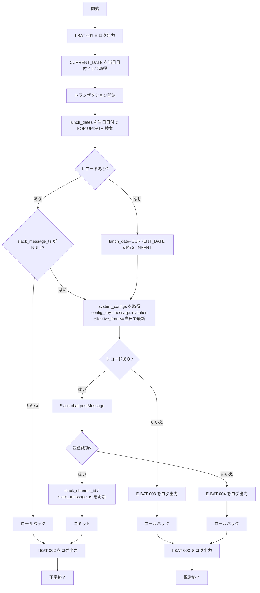

# BAT-001: 日次コラボランチ案内配信

<BasicInfo
  v-if="section"
  :title="section.infoTitle"
  :fields="section.fields"
  :data="frontmatter"
/>

## 目的

**当日レコード** を DB に登録し、コラボランチ募集メッセージを **指定 Slack チャンネルに 1 回** 投稿。

## 入出力

### 入力

| 種別     | 名称                                                                                  | 説明                             |
| -------- | ------------------------------------------------------------------------------------- | -------------------------------- |
| 環境変数 | `SLACK_BOT_TOKEN`                                                                     | Slack API 呼び出し用トークン     |
| 環境変数 | 案内先チャンネル ID                                                                   | 募集を投稿するチャンネル         |
| 参照     | システム日時                                                                          | 実施日 `lunch_date`（JST）に使用 |
| テーブル | <InternalLink path="/database/pdm/table/lunch_dates">lunch_dates</InternalLink>       | 実施日レコードの有無チェック     |
| テーブル | <InternalLink path="/database/pdm/table/system_configs">system_configs</InternalLink> | メッセージテンプレート取得       |

### 出力

| 種別     | 名称                                                                            | 説明                                                                       |
| -------- | ------------------------------------------------------------------------------- | -------------------------------------------------------------------------- |
| テーブル | <InternalLink path="/database/pdm/table/lunch_dates">lunch_dates</InternalLink> | 実施日レコードの新規登録と `slack_channel_id`、`slack_message_ts` の更新。 |
| Slack    | 募集メッセージ 1 件                                                             | 文面はテンプレ                                                             |
| ログ     | 構造化ログ                                                                      | 成功 / 失敗                                                                |

## 処理フロー

## 処理詳細

1. [I-BAT-001](../messages#I-BAT-001) をログ出力。

2. データベースから、`CURRENT_DATE` を `当日日付` として取得。

3. トランザクション開始。

4. <InternalLink path="database/pdm/table/lunch_dates">lunch_dates</InternalLink> の `lunch_date` が `当日日付` のレコードを `For Update` 指定で検索。

5. レコードが存在 かつ `slack_message_ts` が NULL 以外の場合、ロールバックし、12 へ。

6. 当日レコード未登録の場合のみ、`lunch_date` に `CURRENT_DATE` のみ設定し登録。

7. <InternalLink path="database/pdm/table/system_configs">system_configs</InternalLink> の `config_key` が `message.invitation`、`effective_from` <= CURRENT_DATE のうち最新のレコードを取得。

8. レコードが存在しない場合、

8-1. [E-BAT-003](../messages#E-BAT-003) に `message.invitation` を指定し、ログ出力。

8-2. ロールバックし、14 へ。

9. Slack の [chat.postMessage](https://api.slack.com/methods/chat.postMessage) API で、指定されたチャンネルに、コラボランチ参加募集メッセージ送信。

10. 送信に失敗した場合

10-1. [E-BAT-004](../messages#E-BAT-004) をログ出力。

10-2. ロールバックし、14 へ。

11. 送信に成功した場合

11-1. 当日レコードに 9 で送信したメッセージのチャンネルID を `slack_channel_id`、送信タイムスタンプを `slack_message_ts` にセットして更新。

11-2. コミット。

### 正常終了

12. [I-BAT-002](../messages#I-BAT-002) をログ出力。

13. `正常終了`。

### 異常終了

14. [I-BAT-003](../messages#I-BAT-003) をログ出力。

15. `異常終了`。

## 関連

- バッチフロー: [FLW-001: 日次（午前）コラボランチ案内](../flow/flw-001.md)
