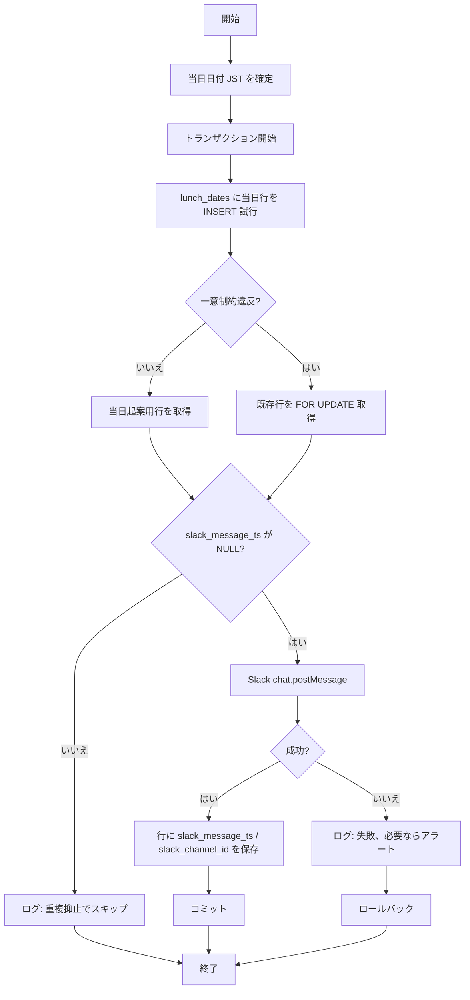

# BAT-001: 日次コラボランチ案内配信

<BasicInfo
  v-if="section"
  :title="section.infoTitle"
  :fields="section.fields"
  :data="frontmatter"
/>

## 目的

**当日レコード** を DB に登録し、コラボランチ募集メッセージを **指定 Slack チャンネルに 1 回** 投稿。

## 入出力

### 入力

| 種別     | 名称                 | 説明                                                                                   |
| -------- | -------------------- | -------------------------------------------------------------------------------------- |
| 環境設定 | `SLACK_BOT_TOKEN` 等 | Slack API 呼び出し（機微は環境変数・Secret）                                           |
| 環境設定 | 案内先チャンネル ID  | 募集を投稿するチャンネル（要件: デプロイ時設定。将来 `system_configs` 参照に寄せうる） |
| 参照     | システム日時         | 当日の `lunch_date`（JST）算出に使用                                                   |

### 出力

| 種別     | 名称                                                | 説明                                                                           |
| -------- | --------------------------------------------------- | ------------------------------------------------------------------------------ |
| テーブル | [lunch_dates](../../database/pdm/table/lunch_dates) | 開催日（ドラフト `lunch_dates`）。`slack_message_ts` で重複抑止                |
| Slack    | 募集メッセージ 1 件                                 | 文面はテンプレ＋必要ならテンプレ ID（`batch/messages` 由来のコードと紐づけ可） |
| ログ     | 構造化ログ                                          | 成功 / 重複抑止スキップ / 失敗（本文に run id、lunch_date、message ts）        |

## 処理フロー

## 処理詳細

1. [I-BAT-001](../messages#I-BAT-001) をログ出力。

2. データベースから、`CURRENT_DATE` を `当日日付` として取得。

3. トランザクション開始。

4. <InternalLink path="database/pdm/table/lunch_dates">lunch_date</InternalLink> の `lunch_date` が `当日日付` のレコードを `For Update` 指定で検索。

5. レコードが存在 かつ `slack_message_ts` が NULL 以外の場合、ロールバックし処理終了。

6. 当日レコード未登録の場合のみ、`lunch_date` に `CURRENT_DATE` のみ設定し登録。

7. Slack の [chat.postMessage](https://api.slack.com/methods/chat.postMessage) API で、指定されたチャンネルに、コラボランチ参加募集メッセージ送信。

8. 送信に失敗した場合

8-1. [E-BAT-003](../messages#E-BAT-103) をログ出力。

8-2. ロールバックし、`異常終了`。

9. 送信に成功した場合

9-1. 当日レコードに 4 で送信したメッセージのチャンネルID を `slack_channel_id`、送信タイムスタンプを `slack_message_ts` にセットして更新。

8-2. コミット。

9. `正常終了`。

## 関連

- バッチフロー: [FLW-001: 日次（午前）コラボランチ案内](../flow/daily.md)
