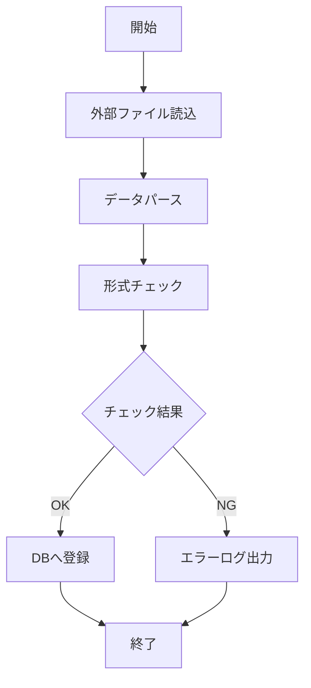

# BAT-001: データ取込バッチ

<BasicInfo
  v-if="section"
  :title="section.infoTitle"
  :fields="section.fields"
  :data="frontmatter"
/>

## 処理フロー

## 入力

| 種別     | 名称            | 説明                                   |
| -------- | --------------- | -------------------------------------- |
| ファイル | import_data.csv | 外部システムからのエクスポートファイル |

## 出力

| 種別     | 名称        | 説明                   |
| -------- | ----------- | ---------------------- |
| テーブル | import_data | 取り込んだデータを格納 |
| ログ     | bat-001.log | 実行ログ               |

## エラーハンドリング

| エラーコード | 説明                 | 対応                               |
| ------------ | -------------------- | ---------------------------------- |
| E001         | ファイルが存在しない | アラート通知、処理中断             |
| E002         | ファイル形式不正     | エラーログ出力、処理中断           |
| E003         | データ形式不正       | エラーレコードをスキップ、処理継続 |
