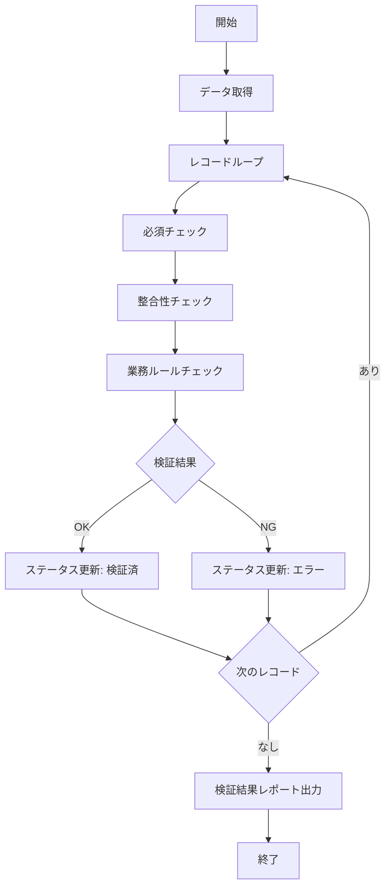

# BAT-002: データ検証バッチ

<BasicInfo
  v-if="section"
  :title="section.infoTitle"
  :fields="section.fields"
  :data="frontmatter"
/>

## 処理フロー

## 入力

| 種別     | 名称        | 説明                      |
| -------- | ----------- | ------------------------- |
| テーブル | import_data | BAT-001で取り込んだデータ |

## 出力

| 種別     | 名称              | 説明           |
| -------- | ----------------- | -------------- |
| テーブル | import_data       | ステータス更新 |
| テーブル | validation_errors | 検証エラー詳細 |
| ログ     | bat-002.log       | 実行ログ       |

## 検証ルール

| ルールID | 項目   | ルール                         |
| -------- | ------ | ------------------------------ |
| V001     | 顧客ID | 必須、顧客マスタに存在すること |
| V002     | 金額   | 必須、0以上の数値              |
| V003     | 日付   | 必須、有効な日付形式           |

## エラーハンドリング

| エラーコード | 説明           | 対応                     |
| ------------ | -------------- | ------------------------ |
| E001         | 対象データなし | 正常終了（処理スキップ） |
| E002         | DB接続エラー   | アラート通知、リトライ   |
