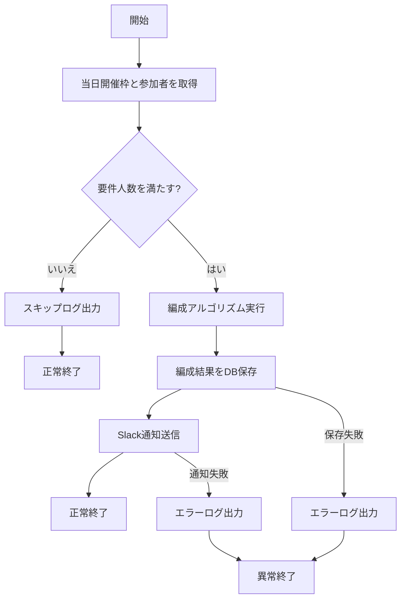

# BAT-003: 日次グループ編成・結果通知

<BasicInfo
  v-if="section"
  :title="section.infoTitle"
  :fields="section.fields"
  :data="frontmatter"
/>

## 目的

当日の参加者を要件に沿ってグループ編成し、編成結果をDBへ保存したうえで Slack 通知を実施する。

## 入出力

### 入力

| 種別     | 名称                                  | 説明 |
| -------- | ------------------------------------- | ---- |
| テーブル | `lunch_dates`                         | 当日開催枠。`id` と `lunch_date` を参照 |
| テーブル | `lunch_participations`                | 当日参加者情報。`status=joined` を対象 |
| 設定     | グループ人数、再編成上限、通知先設定  | マッチング条件と通知先チャンネル |
| 環境設定 | `SLACK_BOT_TOKEN` 等                  | Slack API 呼び出し |

### 出力

| 種別     | 名称                                  | 説明 |
| -------- | ------------------------------------- | ---- |
| テーブル | `lunch_groups`                        | 当日グループ情報を作成 |
| テーブル | `lunch_group_members`                 | グループと参加者の対応を作成 |
| テーブル | `lunch_dates`                         | 通知時刻、実行状態などを更新 |
| Slack    | グループ別通知メッセージ              | 参加者へ編成結果を通知 |
| ログ     | 構造化ログ                            | 正常完了、スキップ、異常を記録 |

## 処理フロー

## 処理詳細

1. [I-BAT-001](../messages#I-BAT-001) をログ出力する。
2. 当日の `lunch_date` をもとに、対象参加者を取得する。
3. 最低人数を満たさない場合、[W-BAT-001](../messages#W-BAT-001) を出力し終了する。
4. 参加回数や人数条件に基づき、グループ編成を実行する。
5. トランザクション内で `lunch_groups` と `lunch_group_members` を更新する。
6. 保存失敗時は [E-BAT-001](../messages#E-BAT-001) を出力しロールバックする。
7. 保存成功後、グループ単位で Slack 通知を送信する。
8. 通知失敗時は [E-BAT-003](../messages#E-BAT-003) を出力し異常終了する。
9. すべて成功したら [I-BAT-002](../messages#I-BAT-002) を出力し正常終了する。

## 関連

- ユーザーストーリー: [US-003](../../user-stories/us-003.md)
