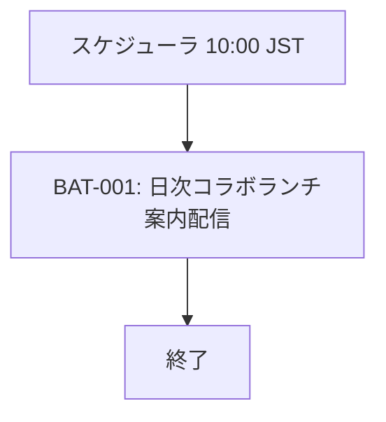

# FLW-001: 日次（午前）コラボランチ案内

<BasicInfo
  v-if="section"
  :title="section.infoTitle"
  :fields="section.fields"
  :data="frontmatter"
/>

## フロー図

## 実行順序

| 順序 | バッチ ID | バッチ名 | 依存関係 |
| ---- | --------- | -------- | -------- |
| 1 | BAT-001 | 日次コラボランチ案内配信 | なし |

## ユーザーストーリー

- [US-001](../../user-stories/us-001.md)

## 補足

- 本リポジトリに残っていた「データ取込」系の多段日次フローは、ランチドメイン定義に置き換え済み（本フローが正）。  
- マッチング等の午後以降のバッチは [US-003](../../user-stories/us-003.md) 系で別途 FLW 化する。
