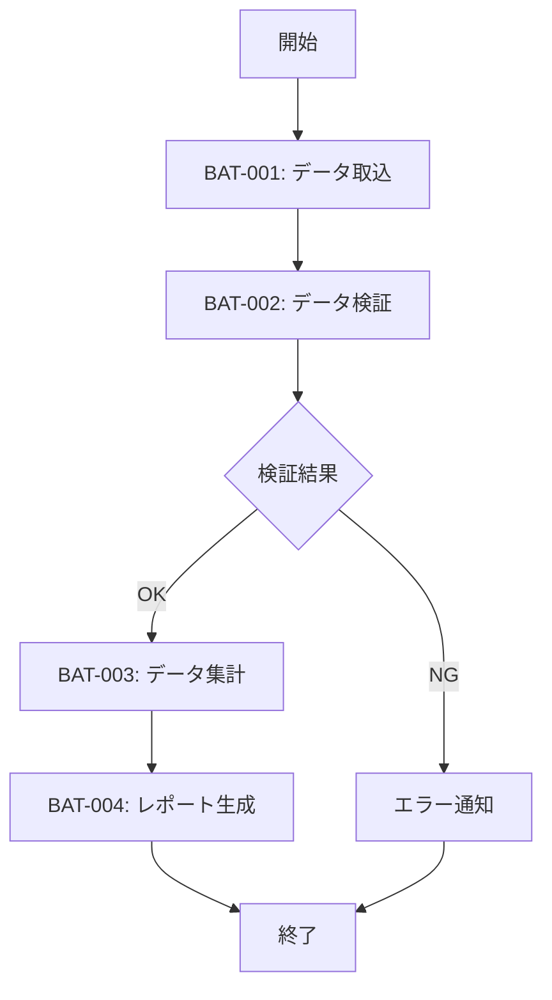

# FLW-001: 日次バッチフロー

<BasicInfo
  v-if="section"
  :title="section.infoTitle"
  :fields="section.fields"
  :data="frontmatter"
/>

## フロー図

## 実行順序

| 順序 | バッチID | バッチ名     | 依存関係 |
| ---- | -------- | ------------ | -------- |
| 1    | BAT-001  | データ取込   | なし     |
| 2    | BAT-002  | データ検証   | BAT-001  |
| 3    | BAT-003  | データ集計   | BAT-002  |
| 4    | BAT-004  | レポート生成 | BAT-003  |

## エラー時の動作

| 発生バッチ | 動作                               |
| ---------- | ---------------------------------- |
| BAT-001    | 処理中断、アラート通知             |
| BAT-002    | エラー通知後、後続バッチはスキップ |
| BAT-003    | 処理中断、アラート通知             |
| BAT-004    | 処理中断、アラート通知             |
