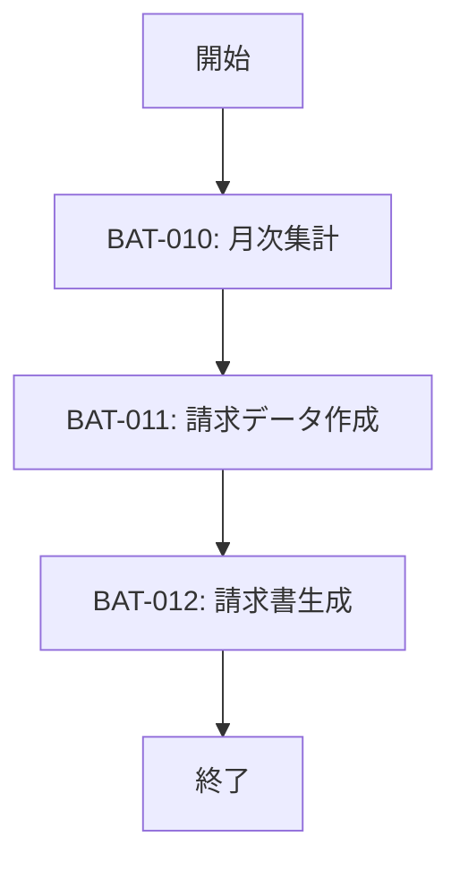

# FLW-002: 月次バッチフロー

<BasicInfo
  v-if="section"
  :title="section.infoTitle"
  :fields="section.fields"
  :data="frontmatter"
/>

## フロー図

## 実行順序

| 順序 | バッチID | バッチ名       | 依存関係 |
| ---- | -------- | -------------- | -------- |
| 1    | BAT-010  | 月次集計       | なし     |
| 2    | BAT-011  | 請求データ作成 | BAT-010  |
| 3    | BAT-012  | 請求書生成     | BAT-011  |

## エラー時の動作

| 発生バッチ | 動作                   |
| ---------- | ---------------------- |
| BAT-010    | 処理中断、アラート通知 |
| BAT-011    | 処理中断、アラート通知 |
| BAT-012    | 処理中断、アラート通知 |
