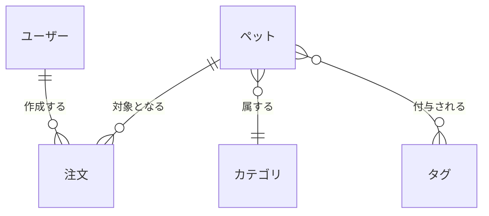

# 概念データモデル

## ビジネス・エンティティ

| エンティティ | 説明                                                                                                                                                     |
| ------------ | -------------------------------------------------------------------------------------------------------------------------------------------------------- |
| ペット       | ペットストアで管理される動物を表すエンティティ。基本的な説明情報を持ち、カテゴリに属し、複数のタグを付与できます。また、注文の対象となることがあります。 |
| カテゴリ     | ペットの分類を表すエンティティ。「犬」「猫」「鳥」など、同じ種類のペットをグルーピングする目的で使用します。                                             |
| タグ         | ペットに付与されるラベルを表すエンティティ。特徴、条件、管理目的の属性など、カテゴリとは別の軸でペットを分類するために使われます。                       |
| 注文         | ペットの購入依頼を表すエンティティ。数量、ステータス、配送予定などの業務上の情報を含みます。                                                             |
| ユーザー     | システムを利用する人物を表すエンティティ。ユーザーはペットの管理や注文の作成など、システム上の操作を行います（役割に応じて異なる場合があります）。       |

## リレーションシップ

| エンティティ1 | エンティティ2 | 関係種別               | 説明                                                                                      |
| ------------- | ------------- | ---------------------- | ----------------------------------------------------------------------------------------- |
| ペット        | カテゴリ      | 多対1（Many-to-One）   | ペットは必ず 1 つのカテゴリに属します。1 つのカテゴリには複数のペットが含まれます。       |
| ペット        | タグ          | 多対多（Many-to-Many） | 1 つのペットに複数のタグを付与できます。1 つのタグは複数のペットに適用されます。          |
| 注文          | ペット        | 多対1（Many-to-One）   | 1 件の注文は 1 匹のペットを対象とします。ペットは複数の注文を受けることがあります。       |
| ユーザー      | 注文          | 1対多（One-to-Many）   | ユーザーは複数の注文を作成することができます。注文は 1 人のユーザーによって作成されます。 |
