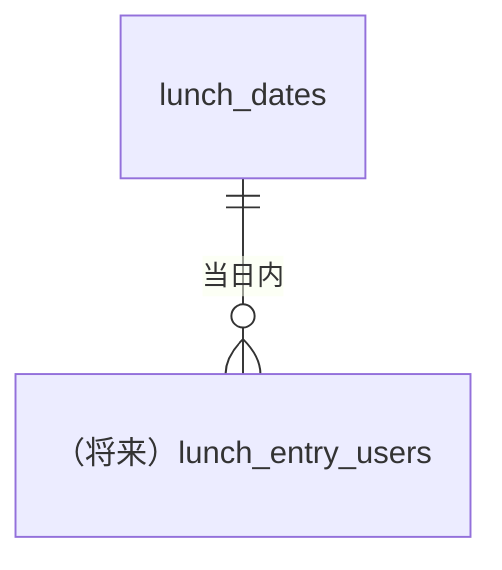

# 概念データモデル（CDM）

ランチマッチング領域の主要エンティティ。物理定義（PDM）は [PDM テーブル](./pdm/table/) を正とし、本書は用語と関係の整合に用いる。エンティティ名・テーブル名の正本はリポジトリルートの `luncher-system-design-draft.md` §4（データモデル）と揃える。

## 開催日（コラボランチ枠）

**説明**: カレンダー日（JST）ごとの 1 日 1 枠。`lunch_dates` テーブル。日次案内（[US-001](../user-stories/us-001.md)）に対応する [BAT-001](../batch/design/bat-001.md) で行が作られ、案内直後の参加表明・マッチング等の **その日の活動** の根拠となる。

**主な属性（概念）**

- 開催日 `lunch_date`（JST。行の主キー）
- 案内 Slack メッセージの識別子（重複案内の抑止と追跡）
- 作成・更新日時

**PDM 対応**: [lunch_dates](pdm/table/lunch_dates)

## 利用者

**説明**: Slack 上の人物に相当（Slack user id / 社内のユーザー主キーは物理設計で定義）。ドラフト上は `users` テーブル。[US-002](../user-stories/us-002.md) 以降で `lunch_entry_users` 等と接続する。本版の US-001 では開催日の行の生成が主で、利用者行の新規作成は必須ではない。

## リレーションシップ（本版の範囲）

- 店舗・確定ランチ・`system_configs` 等のエンティティは [US-002](../user-stories/us-002.md) 以降の CDM/PDM 更新と `luncher-system-design-draft.md` の表を拡充して補完する。
