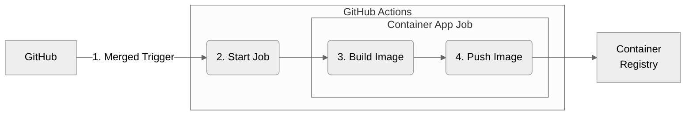
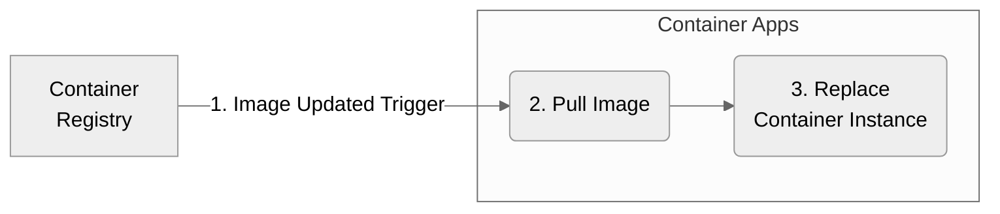

# CI/CD（イメージ配布）

GitHub Actions によるコンテナのデプロイは、以下の方式で実施。

## 概要フロー

### プッシュ

1. 環境ブランチ（`main`, `staging`, `develop`）にマージされたことをトリガーに GitHub Action 起動。
1. GitHub Action から `Azure CLI` を使って、`Container App Job` に登録された `GitHub セルフホステッドランナー` を起動。
1. `GitHub セルフホステッドランナー` 内で、対象ブランチのソースコードを取得し、イメージをビルド。
1. `GitHub セルフホステッドランナー` から、`Private Link` 経由で、イメージを `Container Registry` にプッシュ。

---

### プル

1. `Container Apps` で、`自動デプロイ` を有効にすることで、`Container Registry` のイメージ更新をトリガーにインスタンス更新を開始。
1. マネージド ID を使って、`Container Apps` から `Container Registry` の最新イメージをプル。
1. `Container Apps` のインスタンスをリプレース。

## リソースと役割

| リソース                    | 役割                                                                                                                                                                                                                                                                                                                                    |
| --------------------------- | --------------------------------------------------------------------------------------------------------------------------------------------------------------------------------------------------------------------------------------------------------------------------------------------------------------------------------------- |
| **Container Registry**      | イメージ保管。pull / push とも **Private Endpoint 経由**（**Premium SKU が PE に必要**）。**admin user は無効化**し、アクセスは、Entra トークンのみ。**Defender for Containers** と **ACR の脆弱性評価**を有効化。                                                                                                                      |
| **GitHub / GitHub Actions** | トリガーは `push`、PR、`workflow_dispatch`、Environment 保護ルール連動デプロイ等。**同一デプロイワークフロー内**で `az containerapp job start` 等により **オンデマンドの Container Apps Job** を開始し、**VNet 内ランナー**が GitHub に接続してからイメージビルド・ACR・Terraform を進める。ランナー登録トークンは Key Vault 等で管理。 |

### Container Registry

### Container App Jobs

### Container Apps

### Container Instances

## 認証

詳細は [セキュリティ](./security.md) の「アクセス制御（RBAC）・CI/CD 認証」。**GitHub → Azure は OIDC のみ**。環境ごとと `shared` 用のエンタープライズアプリを分け、**subject 条件と GitHub Environment 保護ルール**で濫用を防ぐ。

## ネットワーク上の位置づけ

- **GitHub ランナー専用 CAE** と **メイン CAE** は分離（[コンテナ実行基盤](./containers.md)、[ネットワーク](./network.md) の Firewall）。
- ランナーは **Firewall で HTTPS を広く許可**しつつ、**ACR への push は Private Endpoint** 経由。

## 関連ページ

- [セキュリティ](./security.md)
- [環境・Terraform](./environment.md)
- [コンテナ実行基盤](./containers.md)
- [リソース一覧](./resources.md)
