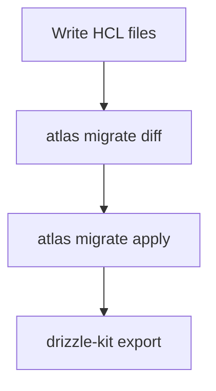

# データベース

このプロジェクトのデータベースに関する説明を提供します。

## データベース設計

データベースオブジェクトは、すべて [Atlas HCL](https://atlasgo.io/atlas-schema/hcl) で記述します。  
Atlas HCL は、この設計書の [データベース・物理データモデル](../database/pdm/) に自動的に反映されます。

コメントのメタデータ、i18n 定義を独自に追加しています。

```hcl
table "pet" {
  comment = """
  {
    "logical_name": "ペット",
    "description": "ペットの情報を管理するテーブルです。",
    "i18n": {
      "en": {
        "logical_name": "Pet",
        "description": "Stores information about pets."
      }
    }
  }
  """

  column "pet_id" {
    type = uuid
    null = false
    comment = """
    {
      "logical_name": "ペットID",
      "description": "ペットの一意識別子",
      "i18n": {
        "en": {
          "logical_name": "Pet ID",
          "description": "Unique identifier for the pet."
        }
      }
    }
    """
  }

  column "name" {
    type = string
    comment = """
    {
      "logical_name": "ペット名",
      "description": "ペットの名前",
      "i18n": {
        "en": {
          "logical_name": "Name",
          "description": "The name of the pet."
        }
      }
    }
    """
  }

  column "category_id" {
    type = uuid
    comment = """
    {
      "logical_name": "カテゴリーID",
      "description": "カテゴリーの識別子",
      "i18n": {
        "en": {
          "logical_name": "Category ID",
          "description": "Unique identifier of the category"
        }
      }
    }
    """
  }

  column "photo_urls" {
    type = sql(text[])
    comment = """
    {
      "logical_name": "カテゴリーID",
      "description": "カテゴリーの識別子",
      "i18n": {
        "en": {
          "logical_name": "Category ID",
          "description": "Unique identifier of the category"
        }
      }
    }
    """
  }

  column "status" {
    type = enum.status
    null = false
    default = "pending"
    comment = """
    {
      "logical_name": "ステータス",
      "description": "ペットの販売ステータス",
      "i18n": {
        "en": {
          "logical_name": "Status",
          "description": "Pet status in the store"
        }
      }
    }
    """
  }

  primary_key {
    columns = [column.pet_id]
  }

  foreign_key "fk_category" {
    columns     = [column.category_id]
    ref_columns = [table.category.column.category_id]
    on_delete   = CASCADE
    on_update   = NO_ACTION
  }

  unique "uq_pet_name" {
    columns = [column.name]
  }

  index "idx_status" {
    columns = [column.status]
  }

  index "idx_category" {
    columns = [column.category_id]
  }
}

```

## マイグレーション

Atlas HCL で定義したデータベース設計を使い、Atlas CLI でマイグレーションを管理します。  
Atlas を利用するのは以下の理由からです。

- **宣言的スキーマ（HCL）**

  Atlas HCL は、Terraform の HCL と同じようにデータベース・オブジェクトを定義できます。  
   マイグレーションファイルも、Terraform のように定義と実際のデータベースから、Atlasが自動生成するので、ORMマイグレーションファイルを記述する必要がありません。

- **マイグレーション履歴の管理**

  Atlas CLI は、マイグレーション履歴を管理できます。

- **ORM依存の回避**

  Atlas は、Prisma や TypeORM のように「ORM がスキーマとマイグレーションを独占する」構造ではなく、他のORMと組み合わせて使用できます。
  Prisma や TypeORM であっても、そのスキーマファイルを使って、Atlas の宣言的マイグレーションを実行できます。

## ORM

このプロジェクトでは、[Drizzle ORM](https://orm.drizzle.team/docs/overview) を使用します。

## マイグレーション・ORM連携

以下のワークフローで、マイグレーション、スキーマ定義を管理します。



### ワークフロー

1. **HCLファイルを書く**

   データベースオブジェクトを HCLファイルで書きます。  
   [Atlas HCL](https://atlasgo.io/atlas-schema/hcl) は、テーブル以外のデータベースオブジェクトをサポートします。

1. **差分チェック**

   Atlas CLI [atlas migrate diff](https://atlasgo.io/versioned/diff) で差分をチェックします。  
   Terraform の `terraform plan` に該当し、マイグレーションファイルを自動生成します。

1. **マイグレーション**

   Atlas CLI [atlas migrate apply](https://atlasgo.io/versioned/apply) でマイグレーションを実行します。  
   Terraform の `terraform apply` に該当します。

1. **Drizzleスキーマ定義を更新**

   Drizzle CLI `drizzle-kit export` でDrizzleスキーマ定義ファイルを更新します。

## DBMS

このプロジェクトでは、[Azure Database for PostgreSQL Flexible Server](https://learn.microsoft.com/ja-jp/azure/postgresql/flexible-server/overview) を使用します。

## コネクションプーリング

このプロジェクトでは、Flexible Server に組み込まれたマネージドの [pgBouncer](https://learn.microsoft.com/ja-jp/azure/postgresql/flexible-server/concepts-pgbouncer) を使用します。  
APIサーバーなどでは、コネクションプーリングを実装しません。

## Azure 基盤（インフラ設計との対応）

アプリケーションのスキーマ・マイグレーション（Atlas / Drizzle）は上記のとおり。ここでは **Terraform で構築する PostgreSQL 基盤**と **接続経路**を `infra/blueprint.md`（リポジトリルート）に合わせて整理する。

### サーバーと認証

- **Azure Database for PostgreSQL Flexible Server** を **Private Endpoint** で閉域化（VNet 統合方式とは排他的で後から変更不可）。Private DNS は `privatelink.postgres.database.azure.com`。
- **Entra ID 認証必須（パスワード認証無効）**。エンジンバージョン・SKU は負荷に合わせて選定する。
- **同一サーバー上に用途別データベース**（例: 業務 `mss`、**Apache Airflow メタデータ `airflow`**）を分けて作成する。
- **pgBouncer** は Flexible Server の**組み込み機能**を利用する（上記「コネクションプーリング」と一体）。

接続ホスト名は **`{server-name}.postgres.database.azure.com`**（公式 FQDN）に統一し、名前解決は Private DNS で PE の IP へ向ける（[ネットワーク](./network.md)）。

### 接続経路と pgBouncer

PostgreSQL への接続経路は主に次のように分類する。pgBouncer（transaction pooling）はセッション単位の状態を保持しないため、**短命なリクエスト・レスポンスに適する API のみ**が経由する。

| 経路                 | ポート | 対象（例）                                               | pgBouncer を経由しない理由                                                                   |
| -------------------- | ------ | -------------------------------------------------------- | -------------------------------------------------------------------------------------------- |
| **pgBouncer 経由**   | 6432   | API（`id-mss-{env}-api`）                                | —                                                                                            |
| **Batch 直接接続**   | 5432   | Batch（`id-mss-{env}-batch`）                            | 長時間トランザクション・一時テーブル・Advisory Lock 等、transaction pooling の制約に合わない |
| **Airflow 直接接続** | 5432   | Airflow（`id-mss-{env}-airflow`）                        | メタデータ DB は **5432 で直接**                                                             |
| **人的直接接続**     | 5432   | db-biz-reader / db-dev-reader / db-dev-writer / 障害調査 | 対話的セッションでセッション一貫性が必要                                                     |
| **Azure 内部予約**   | —      | 監視・レプリケーション                                   | 15 接続（固定、ユーザー利用不可）                                                            |

### `default_pool_size` の見積り（リトルの法則）

`default_pool_size` はユーザー/DB ペアあたりに pgBouncer が PostgreSQL へ張るサーバー接続数（既定 50）。本構成では API の１ペアのみが対象。

```
default_pool_size = max_concurrent_users × requests_per_sec_per_user × avg_transaction_duration_sec × safety_factor
```

- `safety_factor`: ピーク時のバースト余裕（2〜3）

### 接続数の配分表（例: General Purpose D2s_v3）

| 枠                | 算出根拠                     | 接続数               |
| ----------------- | ---------------------------- | -------------------- |
| `max_connections` | SKU 依存（例: D2s_v3）       | 859                  |
| Azure 内部予約    | 固定                         | −15                  |
| pgBouncer（API）  | `default_pool_size` × 1 ペア | −`default_pool_size` |
| Batch 直接        | KEDA 最大レプリカ数 × 1      | −最大レプリカ数      |
| Airflow 直接      | スケジューラ・Web 等の見積り | −見積もり            |
| 人的直接接続      | グループ別ロール + 障害調査  | −見積もり            |
| **余裕**          | 上記の残り                   | 残枠                 |

**上限の確認式**

```
pgBouncer(default_pool_size × 1) + Batch(KEDA 最大レプリカ数 × 1) + Airflow(メタデータ接続の見積り) + 人的アクセス枠 + 15 ≤ max_connections
```

**見直すタイミング**: 負荷試験後、KEDA 最大レプリカ数変更時、**Airflow のスケール／Executor 変更時**、実測メトリクス（接続待ち・プール枯渇）に基づく。

### 関連ページ

- [ネットワーク](./network.md)（Private DNS・PE）
- [セキュリティ](./security.md)（Entra 認証・人的アクセス・PIM）
- [ジョブオーケストレーション](./job-orchestration.md)
- [リソース一覧](./resources.md)
