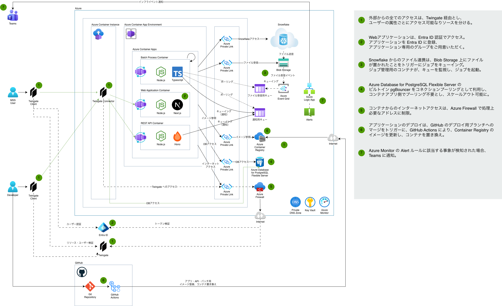

# インフラ構成

## インフラ構成図

## 概要説明

1. システムへの全てのアクセスは、Twingate 経由とし、ユーザーの属性ごとにアクセス可能なりソースを分ける。
1. Web アプリケーションは、Entra ID 認証でアクセス。
1. Snowflake からのファイル連携は、Blob Storage 上にファイルが置かれたことをトリガーにジョブをキューイング。 ジョブ管理用のコンテナが、キューを監視し、ジョブを起動。
1. Azure Database for PostgreSQL Flexible Server のビルトイン pgBouncer をコネクションプーリングとして利用し、コンテナアプリ側でプーリング不要とし、スケールアウト可能に。
1. コンテナからのインターネットアクセスは、Azure Firewall で、処理上必要なアドレスに制限。
1. アプリケーションのデプロイは、GitHub のデプロイ用ブランチへのマージをトリガーに、GitHub Actions により、Container Registry のイメージを更新し、コンテナを置き換え。
1. Azure Monitor の Alert ルールに該当する事象が検知された場合、Teams に通知。
