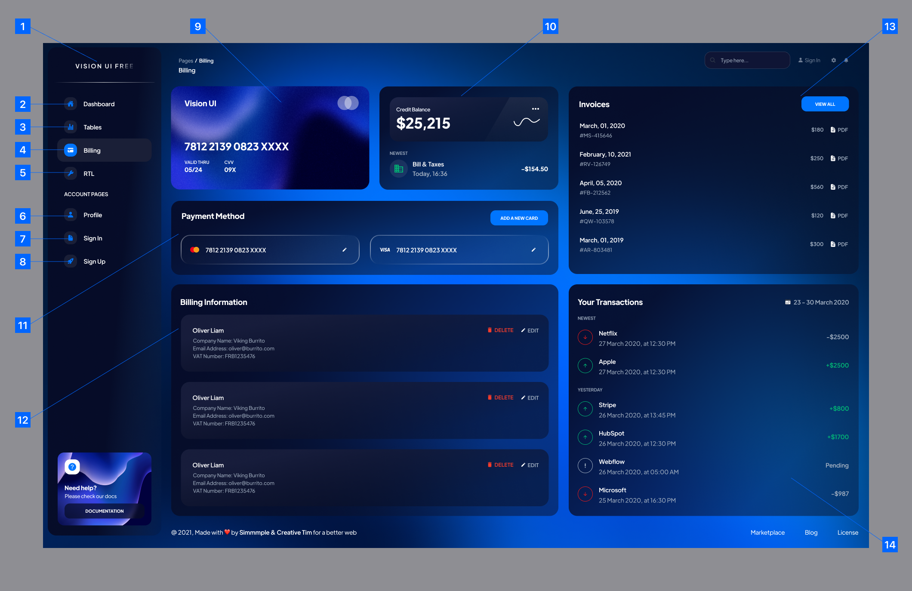

# ホーム画面

## レイアウト

<BasicInfo
  v-if="section"
  :title="section.infoTitle"
  :fields="section.fields"
  :data="frontmatter"
/>

## 項目

|  No | 項目名               | タイプ         | S.I.O | 値               | 書式 | 入力制限 | 必須 | 説明                   |
| --: | -------------------- | -------------- | :---: | ---------------- | ---- | -------- | ---- | ---------------------- |
|   1 | ロゴ                 | 画像           |   S   | /images/logo.svg |      |          |      |                        |
|   2 | ダッシュボードリンク | ハイパーリンク |   S   | Dashboard        |
|   3 | テーブルリンク       | ハイパーリンク |   S   | Tables           |
|   4 | 請求リンク           | ハイパーリンク |   S   | Billing          |
|   5 | RTLリンク            | ハイパーリンク |   S   | RTL              |
|   6 | プロファイルリンク   | ハイパーリンク |   S   | Profile          |      |          |      |                        |
|   7 | サインインリンク     | ハイパーリンク |   S   | Sign In          |      |          |      | 未ログイン時のみ表示。 |
|   8 | サインアップリンク   | ハイパーリンク |   S   | Sign Up          |      |          |      | 未ログイン時のみ表示。 |
|   9 | ダッシュボードリンク | ハイパーリンク |   S   | Dashboard        |
|  10 | 請求リンク           | ハイパーリンク |   S   | Billing          |
|  11 | ロゴ                 | 画像           |   S   | /images/logo.svg |      |          |      |                        |
|  12 | ダッシュボードリンク | ハイパーリンク |   S   | Dashboard        |
|  13 | 請求リンク           | ハイパーリンク |   S   | Billing          |
|  14 | ダッシュボードリンク | ハイパーリンク |   S   | Dashboard        |

## イベント

|  No | 項目                 | イベント | アクション                                                                   |
| --: | -------------------- | -------- | ---------------------------------------------------------------------------- |
|   1 | 画面                 | 初期表示 | 1. <InternalLink path="api/app/operations/getHealth.html">ヘルスチェックAPI</InternalLink> を呼び出す。 |
|   2 | ダッシュボードリンク | クリック | 1. [ダッシュボード](login) に遷移。                                        |
