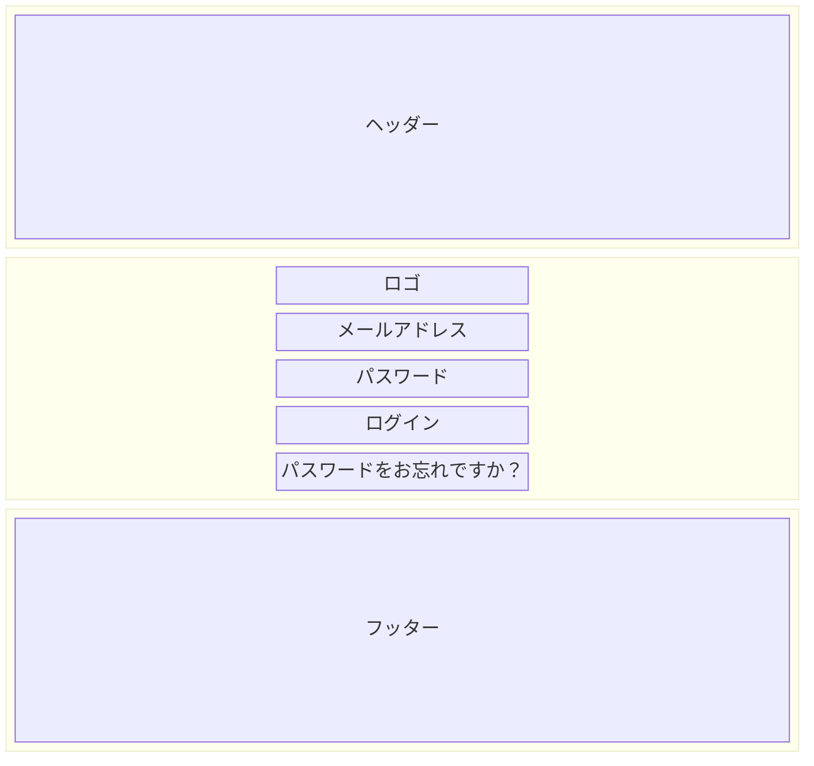

# ログイン画面

## レイアウト

<BasicInfo
  v-if="section"
  :title="section.infoTitle"
  :fields="section.fields"
  :data="frontmatter"
/>

## 項目一覧

| No  | 項目名                     | タイプ   | I/O種別 | 値         | 書式 | 入力制限                                    | 必須 | 説明 |
| --- | -------------------------- | -------- | ------- | ---------- | ---- | ------------------------------------------- | ---- | ---- |
| 1   | メールアドレス             | テキスト | Input   | `email`    | -    | 半角英数字・記号（メール形式）、256文字以内 | ✓    |      |
| 2   | パスワード                 | テキスト | Input   | `password` | -    | 半角英数字・記号、8〜128文字                | ✓    |      |
| 3   | ログイン                   | ボタン   | Input   | 固定値     | -    | -                                           |      |      |
| 4   | パスワードをお忘れですか？ | リンク   | Output  | 固定値     | -    | -                                           |      |      |

## イベント

| No  | 項目                         | イベント | アクション                                                                                                                                                                                                                                                                                                                                                                                                                                       |
| --- | ---------------------------- | -------- | ------------------------------------------------------------------------------------------------------------------------------------------------------------------------------------------------------------------------------------------------------------------------------------------------------------------------------------------------------------------------------------------------------------------------------------------------ |
| 1   | 画面                         | 初期表示 | 1. 画面初期化 2. メールアドレス欄・パスワード欄の空表示                                                                                                                                                                                                                                                                                                                                                                                       |
| 2   | 3 ログイン                   | クリック | 1. 入力値バリデーション（未入力: <InternalLink path="screen/messages.html#E001">E001</InternalLink> / <InternalLink path="screen/messages.html#E003">E003</InternalLink>、形式不正: <InternalLink path="screen/messages.html#E002">E002</InternalLink>）。 2. 認証API呼び出し。 3. 成功時は [ホーム画面](home) に遷移。 4. 失敗時エラーメッセージ表示（認証失敗: <InternalLink path="screen/messages.html#E004">E004</InternalLink>）。 |
| 3   | 4 パスワードをお忘れですか？ | クリック | 1. パスワードリセット画面（`/forgot-password`）に遷移。                                                                                                                                                                                                                                                                                                                                                                                          |
