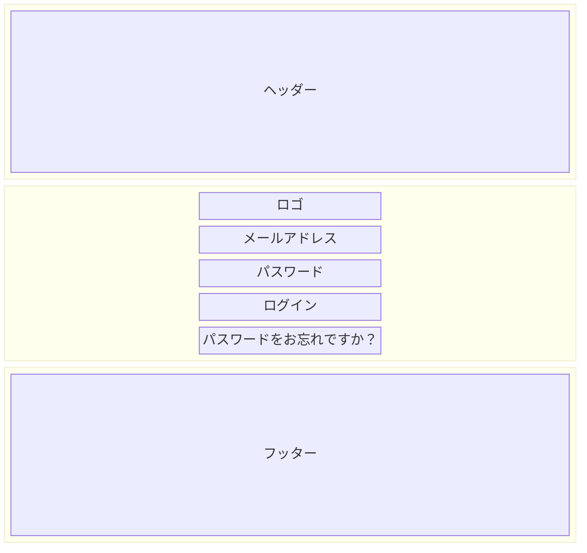

# SCR-001: ログイン画面

## レイアウト

<BasicInfo
  v-if="section"
  :title="section.infoTitle"
  :fields="section.fields"
  :data="frontmatter"
/>

## 入力項目

| 項目名         | 必須 | 型       | 最大桁数 | バリデーション |
| -------------- | ---- | -------- | -------- | -------------- |
| メールアドレス | ○    | text     | 256      | メール形式     |
| パスワード     | ○    | password | 128      | 8文字以上      |

## ボタン・リンク

| 名称                       | 種類   | 動作                                       |
| -------------------------- | ------ | ------------------------------------------ |
| ログイン                   | ボタン | 認証処理を実行し、成功時はホーム画面へ遷移 |
| パスワードをお忘れですか？ | リンク | パスワードリセット画面へ遷移               |

## エラーメッセージ

| コード | メッセージ                                       | 発生条件               |
| ------ | ------------------------------------------------ | ---------------------- |
| E001   | メールアドレスを入力してください                 | メールアドレスが未入力 |
| E002   | 正しいメールアドレス形式で入力してください       | メール形式不正         |
| E003   | パスワードを入力してください                     | パスワードが未入力     |
| E004   | メールアドレスまたはパスワードが正しくありません | 認証失敗               |
