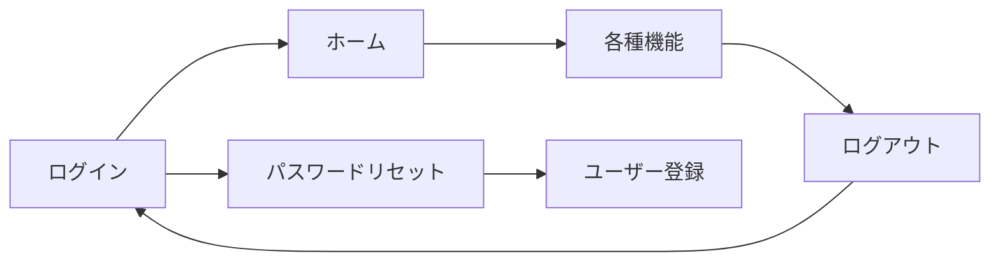

# 認証フロー

<BasicInfo
  v-if="section"
  :title="section.infoTitle"
  :fields="section.fields"
  :data="frontmatter"
/>

## フロー図

## 遷移ルール

1. ログイン成功後にホームへ遷移し、以降は認証必須画面のみアクセス可能。
2. ログアウト時はログイン画面へ戻り、セッションは破棄される。
3. パスワードリセット完了後はログイン画面へ戻り、必要に応じてユーザー登録に遷移できる。
