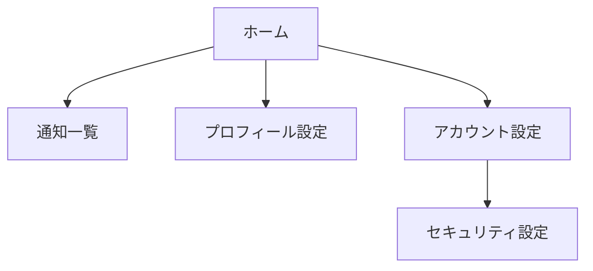

# メインフロー

<BasicInfo
  v-if="section"
  :title="section.infoTitle"
  :fields="section.fields"
  :data="frontmatter"
/>

## フロー図

## 遷移ルール

1. ホーム画面から各機能画面へ直接遷移可能。
2. アカウント設定からのみセキュリティ設定へアクセスできる。
3. 通知一覧や設定画面からホームへは共通のナビゲーションで戻れる。
